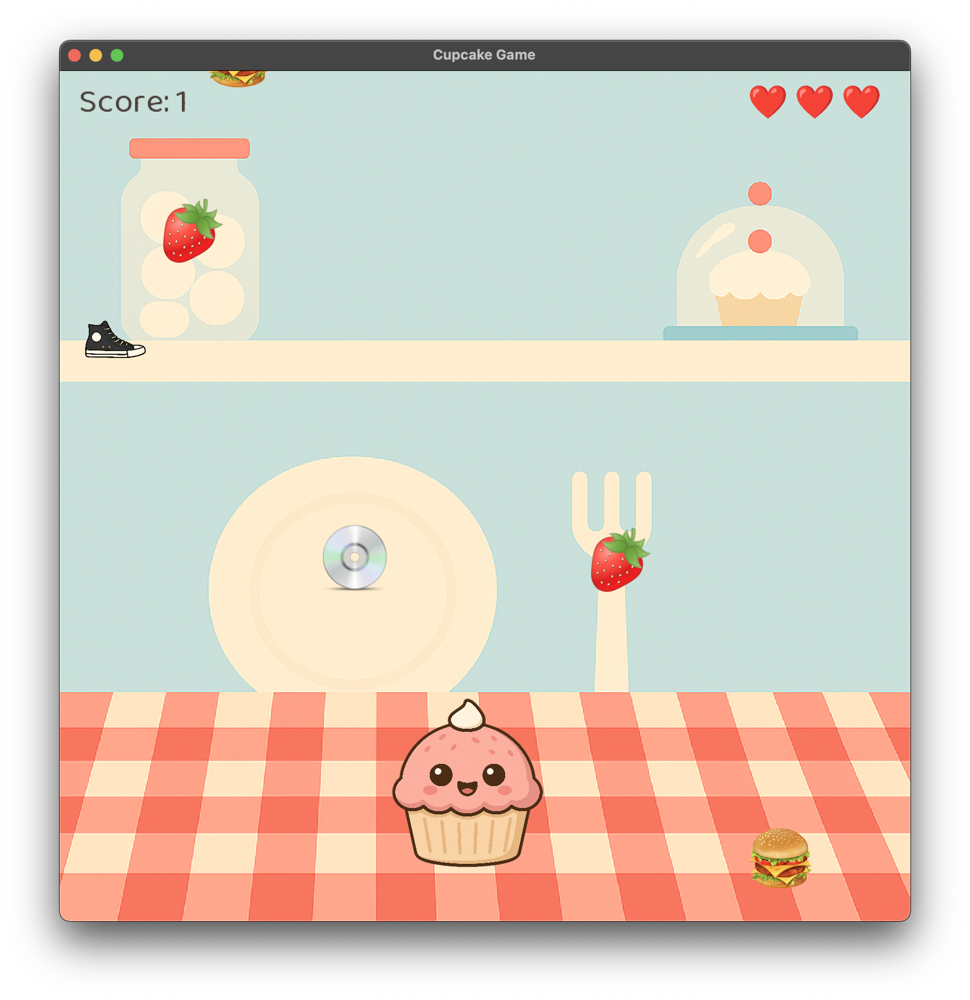

# 🧁 Cupcake Game

Cupcake Gamee is a simple 2D arcade-style game where the player controls a cupcake character and interacts with falling items.  
The objective is to collect good items to increase the score, avoid harmful ones, and survive as long as possible using power-ups and projectiles.

---

## 🎮 Gameplay

- Control the cupcake character and move horizontally.
- Collect good items to increase your score.
- Avoid bad items or destroy them using bullets.
- Use power-ups to gain temporary protection (shield).
- The game ends when all lives are lost.

---

## 🍓 Item Types

- **Good Items** – Increase the player’s score.
- **Bad Items** – Reduce player lives on collision.
- **Power-Up Items** – Grant temporary immunity (shield).
- **Bullets** – Destroy bad items before they reach the player.

---

## ❤️ Scoring & Lives

- Each collected good item increases the score.
- Collisions with bad items reduce lives.
- While a power-up is active, bad items do not reduce lives.

---

## 🧠 Technical Overview

The game is built with an object-oriented design using core entities such as the player, falling objects, collectible items, power-ups, and projectiles.

The project contains multiple launchers, including:
- a basic version,
- an OOP-focused version,
- and a world-units / debugging-oriented launcher.

### Debug & World Units
The project includes debugging utilities for:
- **Debug camera controls** (move/zoom/reset/log) for desktop runs
- **World grid rendering** to visualize world units and viewport bounds
- **Memory info overlay** (Java heap / native heap)

---

## 🛠️ Technologies Used

- Java
- LWJGL 3
- 2D game rendering
- Object-Oriented Programming (OOP)

---

## 🚀 How to Run

1. Clone the repository:
   ```bash
   git clone https://github.com/lejla-gutic/oop-2d-game.git
   ```
2. Open the project in your preferred IDE.
3. Navigate to the desktop launcher package:
   ```swift
   lwjgl3/src/main/java/si/um/feri/Gutic/lwjgl3
   ```
4. Run one of the available launcher classes:
    - Lwjgl3Launcher – basic version
    - Lwjgl3LauncherOO – object-oriented version
    - Lwjgl3LauncherWorldUnits – world units + debugging utilities

---

## 🐞 Debug Controls
Debug camera input is available on Desktop builds.

### Default controls
- Move camera: W / A / S / D
- Zoom in: , (comma)
- Zoom out: . (period)
- Reset camera: Backspace
- Log camera info: Enter

### Configuration
Key bindings and speeds can be configured in:
```pgsql
assets/debug/debugCameraInfo.json
```

---

## 📸 Screenshots



---

## 👤 Author
- **Lejla Gutic**
- GitHub: [lejla-gutic](https://github.com/lejla-gutic)

---

## 📄 License
This project is licensed under the MIT License.
